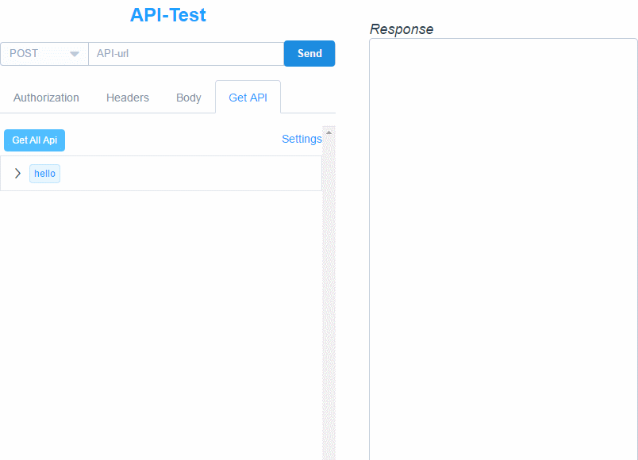

- 安装依赖：pip install -r requirements.txt
- python run.py
 - - -
 - 运行后，localhost:5000/api_test/ 为api测试页面

 - 其中flaskapi包也可以从内网pypi镜像站安装

 - 在appmanage.py中:
   ```python
   app.register_blueprint(api.as_blueprint())
   CORS(app, supports_credentials=True)

   ```
 - 例如在demo_api.py中需要写接口

  > from flaskapi.api import api_add

 - 然后在appmanage.py中导入即可：

  > from demo_api import *

 - 接口注释根据pycharm的自动补全，在参数后面填写数据类型即可；其中:description为接口描述（可选项）

 - 接口模型：

 ```python
@api.dispatcher.add_method
def my_method(param_dict, param_int, param_str, param_list):
    """
    :description  测试接口
    :param param_dict: dict:字典参数
    :param param_int: int:整型参数
    :param param_str: str:字符串参数
    :param param_list: list:列表参数
    :return: code or message
    """
    return result
 ```

---
### 效果图


